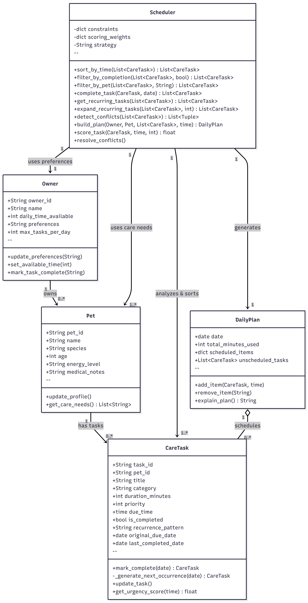

# How to Export UML Diagram to PNG

## Option 1: Mermaid Live Editor (Recommended - Easiest)

1. **Visit** https://mermaid.live
2. **Clear** the default diagram
3. **Paste** the contents of `uml_final.mmd` into the left panel
4. **See** the diagram render on the right
5. **Click** the hamburger menu (☰) in the top-right
6. **Select** "Download" → "PNG"
7. **Save** as `uml_final.png` in your project folder

## Option 2: VS Code with Markdown Preview

1. **Open** `uml_final.mmd` in VS Code
2. **Right-click** → "Open Preview to the Side"
3. **Wait** for Mermaid to render the diagram
4. **Right-click** on rendered diagram → "Download image as PNG"
5. **Save** as `uml_final.png`

## Option 3: Command Line (if you have mermaid-cli installed)

```bash
# Install mermaid-cli globally
npm install -g @mermaid-js/mermaid-cli

# Convert to PNG
mmdc -i uml_final.mmd -o uml_final.png -w 1200 -H 800
```

## Option 4: Using Kroki.io

1. **Visit** https://kroki.io/
2. **Select** "Mermaid" from dropdown
3. **Paste** the contents of `uml_final.mmd`
4. **Click** "Export" → "Download as PNG"
5. **Save** as `uml_final.png`

---

## Quick Verification

Once you have `uml_final.png`, verify it shows:
- ✅ 5 classes: Owner, Pet, CareTask, Scheduler, DailyPlan
- ✅ All attributes (e.g., recurrence_pattern in CareTask)
- ✅ All 11 Scheduler methods including sort_by_time, detect_conflicts, expand_recurring_tasks
- ✅ Correct relationships with cardinalities (1-to-many, etc.)

---

## Integration

To embed the diagram in your README:

```markdown
## System Architecture



See [UML_FINAL_ANALYSIS.md](UML_FINAL_ANALYSIS.md) for detailed explanation of changes from Phase 1 design.
```

---

## File Reference

- **uml_final.mmd** — Raw Mermaid source code (editable text)
- **uml_final.png** — Exported image (generated by one of the options above)
- **UML_FINAL_ANALYSIS.md** — Detailed analysis of changes from original UML
- **original_uml.txt** — Original Phase 1 design for comparison
