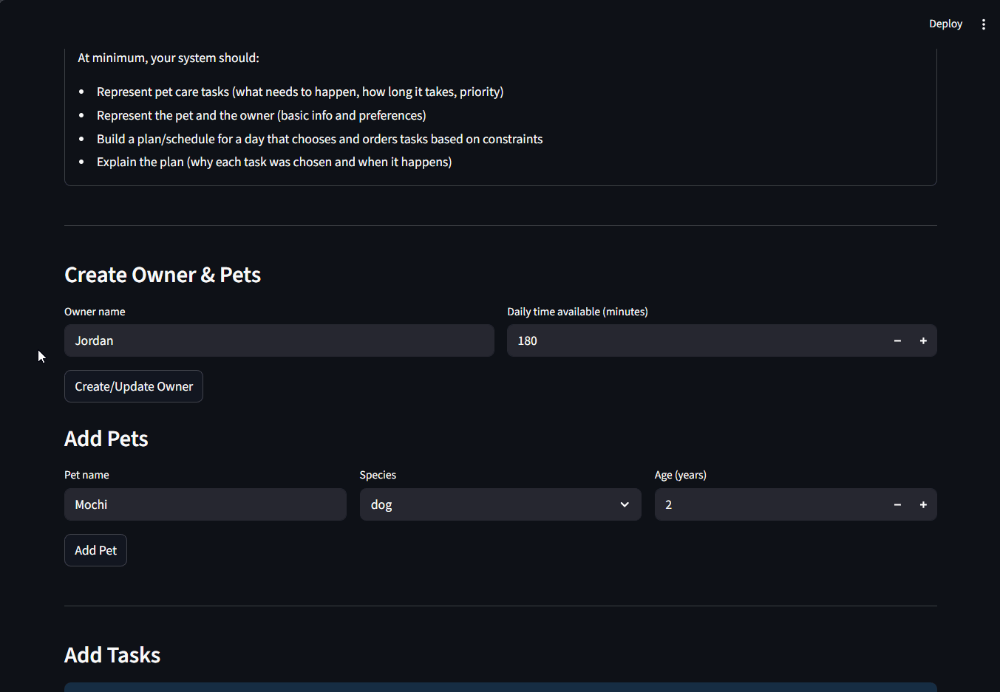

# PawPal+ (Module 2 Project)

You are building **PawPal+**, a Streamlit app that helps a pet owner plan care tasks for their pet.

## Scenario

A busy pet owner needs help staying consistent with pet care. They want an assistant that can:

- Track pet care tasks (walks, feeding, meds, enrichment, grooming, etc.)
- Consider constraints (time available, priority, owner preferences)
- Produce a daily plan and explain why it chose that plan

Your job is to design the system first (UML), then implement the logic in Python, then connect it to the Streamlit UI.

## What you will build

Your final app should:

- Let a user enter basic owner + pet info
- Let a user add/edit tasks (duration + priority at minimum)
- Generate a daily schedule/plan based on constraints and priorities
- Display the plan clearly (and ideally explain the reasoning)
- Include tests for the most important scheduling behaviors

## Demo

<a href="walkthrough.gif" target="_blank"></a>

## Getting started

### Setup

```bash
python -m venv .venv
source .venv/bin/activate  # Windows: .venv\Scripts\activate
pip install -r requirements.txt
```

### Suggested workflow

1. Read the scenario carefully and identify requirements and edge cases.
2. Draft a UML diagram (classes, attributes, methods, relationships).
3. Convert UML into Python class stubs (no logic yet).
4. Implement scheduling logic in small increments.
5. Add tests to verify key behaviors.
6. Connect your logic to the Streamlit UI in `app.py`.
7. Refine UML so it matches what you actually built.

## Features

**Sorting & Ordering**
- `sort_by_time()` – Orders tasks chronologically by due time
- Tasks without due times placed at end

**Filtering & Discovery**
- `filter_by_pet()` – Show only tasks for a specific pet
- `filter_by_completion()` – View pending or completed tasks
- `get_recurring_tasks()` – Find repeating task patterns

**Recurring Task Automation**
- `mark_complete()` – Marks task done and auto-generates next occurrence
- Supports daily, weekly, monthly, and one-time patterns
- Uses `timedelta` for accurate date calculations
- Example: Mark "Morning Walk" complete → automatically creates tomorrow's task

**Schedule Expansion**
- `expand_recurring_tasks()` – Creates 30-day task instances
- Daily task: 30 instances over 30 days
- Weekly task: ~5 instances (every 7 days)
- Monthly task: 1-2 instances (every 30 days)

**Conflict Detection**
- `detect_conflicts()` – Flags when multiple tasks are scheduled at the same time
- Detects conflicts between different pets or same pet
- Returns warning messages with affected tasks
- Prevents scheduling mistakes

**Urgency Scoring**
- `get_urgency_score()` – Calculates task priority based on deadline and importance
- Higher score = more urgent
- Overdue tasks get maximum urgency

---

## Testing PawPal+

### Running the Test Suite

```bash
# Run all tests
python -m pytest  
python -m pytest tests/test_pawpal.py

# Run all tests with verbose output
python -m pytest tests/test_pawpal.py -v

```

### Test Coverage

The test suite includes 32  tests organized into 7 general categories:

#### 1. **Sorting Correctness** (4 tests)
- Chronological ordering of tasks by due time
- Boundary time handling (midnight, noon, 11:59 PM)
- Proper placement of tasks without due times

#### 2. **Recurrence Logic** (6 tests)
- Daily task completion → next day's task automatically generated
- Weekly task completion → 7-day-later task generated
- Monthly task completion → ~30-day-later task generated
- One-time tasks → no next occurrence (returns None)
- Task ID chaining (T001 → T001_1 → T001_2)
- Property preservation (title, duration, priority, due_time)

#### 3. **Conflict Detection** (6 tests)
- Two tasks at same time → conflict flagged
- Multiple conflicts (3+ tasks at same time) → all pairs detected
- Tasks at same time for different pets → still flagged (owner constraint)
- No false positives for different times
- Tasks without due_time excluded from conflicts

#### 4. **Filtering Functionality** (3 tests)
- Filter tasks by completion status (complete/incomplete)
- Filter tasks by pet ID
- Safe empty list returns

#### 5. **Recurring Task Expansion** (5 tests)
- Daily template → 30 instances over 30 days
- Weekly template → 5 instances (days 0, 7, 14, 21, 28)
- Monthly template → correct instance counts
- Multiple recurring templates combined
- Empty template list handling

#### 6. **Edge Cases & Boundary Conditions** (6 tests)
- Urgency scoring without due_time (base priority only)
- Overdue task urgency bonuses
- Time proximity bonuses (30 min, 2 hour thresholds)
- Pet with no tasks (empty returns)
- Last completed date tracking
- Complex task ID patterns

#### 7. **Original Functionality** (2 tests)
- Task completion status changes
- Daily plan task addition and counting

### Test Results

✅ 32 / 32 tests PASSED (0 failures)

### Confidence Level: (5/5 stars)

**Why 5**

- ✅ **Critical features fully tested**: Sorting, recurrence, and conflict detection verified across happy paths and edge cases
- ✅ **Happy path coverage**: All standard use cases (daily/weekly/monthly recurrence, task sorting, filtering) pass
- ✅ **Edge case resilience**: Empty lists, boundary times (midnight/11:59 PM), null values, and complex patterns all handled correctly
- ✅ **Data consistency**: Task properties preserved through generation, completion dates tracked, task IDs incremented safely
- ✅ **Conflict detection reliable**: Multiple pets, same-time detection, and false-positive prevention verified
- ✅ **Expansion algorithm accurate**: 30-day expansion generates correct counts (30 daily, 5 weekly, 1-2 monthly)
- ✅ **No regressions**: Existing functionality (task completion, plan addition) still works
